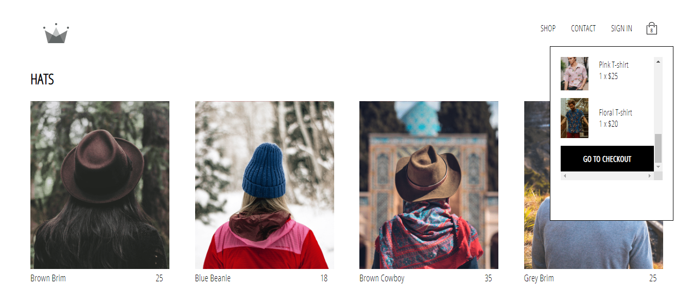

# React Shopping Cart

> This project is an ecommerce shop built with React, Redux, Firebase and GraphQL.





 &nbsp; &nbsp; &nbsp; &nbsp; &nbsp;

## Table of contents

- [React Shopping Cart](#react-shopping-cart)
  - [Table of contents](#table-of-contents)
  - [General info](#general-info)
  - [Technologies](#technologies)
  - [Installation and Usage](#installation-and-usage)
    - [Dev Mode](#dev-mode)
  - [Status](#status)
  - [Contact](#contact)

## General info

This project is an ecommerce shop and allows users to add items to their cart. It implements checkout with Stripe platform. 


## Technologies

- React / Redux / Redux-saga
- Firebase
- GraphQL
- Stripe
- Sass

## Installation and Usage

Prerequisites: 

- [Node.js](https://nodejs.org/en/)
- [Create React App](https://create-react-app.dev/)

To run this project:

- Clone this repo to your local machine using

```shell
$ git clone https://github.com/francislagares/react-firebase-shopping-cart
```

- Switch into directory

```shell
$ cd react-firebase-shopping-cart
```

- Install dependencies

```shell
$ yarn install
```

### Dev Mode

This project is bootstrapped with [Create React App](https://facebook.github.io/create-react-app/docs/getting-started).


- Run server

```shell
$ yarn start
```

- Browser will open automatically at http://localhost:3000

## Status

Currently: _in development..._

## Contact

Created by [@francislagares](https://www.linkedin.com/in/francislagares/) - feel free to contact me!